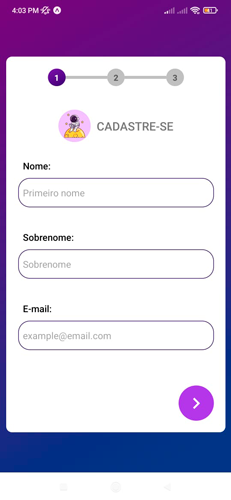
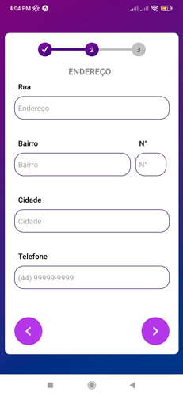

# Formulário multistep React Native

## Sobre

Um formulário multi-etapas desenvolvido com React Native e a ferramenta Expo, fiz com o intuito de reforçar o aprendizado do formulário com ReactJS e sobre a utilização de hooks.

## Screens

- Primeira etapa:



- Segunda etapa:



- Terceira etapa:


- Quarta etapa:


## Como usar

- clone o repositório com o seguinte comando:

```git
git clone https://github.com/Lucasm4sco/form-multistep-react-native.git
```

- Navegue até a pasta do projeto via terminal e execute:

```node
npm install
```

- O comando acima irá instalar as dependências necessárias do código, assim que as dependências forem instaladas você pode iniciar o projeto com os comandos ```npm start``` ou ```npx expo start``` no terminal;

- Após isso será gerado um QRcode que você poderá usar pra acessar o aplicativo através de um emulador ou pelo aplicativo Expo go disponível na Play Store.
